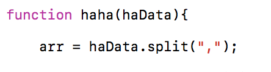
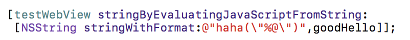
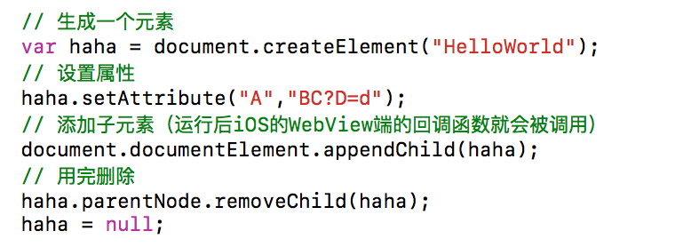

## ① iOS -> JS
### 原理：通过WebView的方法直接调用JS代码
[WebView stringByEvaluatingJavaScriptFromString:@"A"];
// 这里的 A 就是WebView中的html所对应的JS代码

eg.
1）这里一个html所包含的js文件内的一个public方法 

 

2）这是一个.m（iOS）文件内的一个WebView的调用1）中js方法的写法 

 

3）那么在js的对应方法中，就会得到来自iOS的参数 
★ 完成 
 
## ② JS -> iOS 
### 原理：iOS端的WebView的协议函数回调可以获取到其内部html元素的变化以及相应值,JS端只需变化内部元素即可 
 
步骤一：JS端的处理 

 

步骤二：JS端添加子元素后iOS端的回调 
```
WebView   -   UIWebViewDelegate 
 
- (BOOL)webView:(UIWebView *)theWebView shouldStartLoadWithRequest:(NSMutableURLRequest *)request navigationType:(UIWebViewNavigationType)navigationType{ 
	//获取JS端元素变化后的请求字符串（得到BC?D=d）
	NSString *reqString = [[[request URL] absoluteString] stringByReplacingPercentEscapesUsingEncoding: NSUTF8StringEncoding]; 
	// B 可以作为判断Flag
	// C 是调用的iOS的方法名称
	// ? 为分隔符
	// D 为参数名称
	// = 就是等于号，没啥意思
	// d 为具体参数(请以json格式传输，因为iOS的SEL的参数限制)
 
	// 得到了方法名以及参数之后得到SEL对象
	SEL sel = NSSelectorFromString([methodName stringByAppendingString:@":"]); 
	// 也可以得到参数string to dictionary
	NSData *jsonData = [C dataUsingEncoding:NSUTF8StringEncoding]; 
	NSError *err; 
	NSDictionary *argsInfo = [NSJSONSerialization JSONObjectWithData:jsonData 
                                                        options:NSJSONReadingMutableContainers 
                                                          error:&err]; 
    	// 方法有了，参数也有了，调用,参数是以dictionary的形式给出的
    	if ([self respondsToSelector:sel]) { 
    		// 调用方法C，参数为一个字典(iOS中的方法C的参数也应当为dictionary)
    	 	[self performSelector:sel withObject:argsInfo]; 
	} 
}  
```
